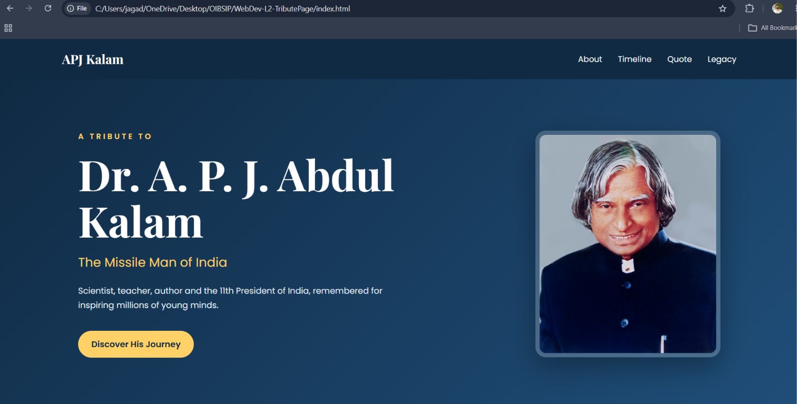
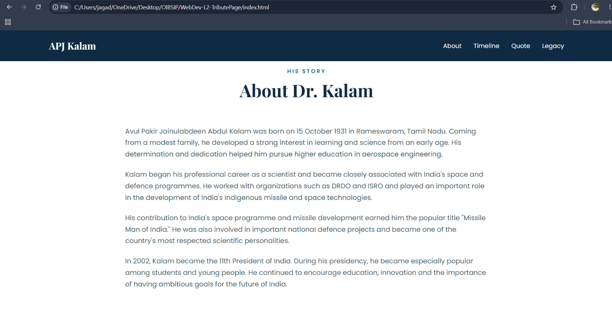
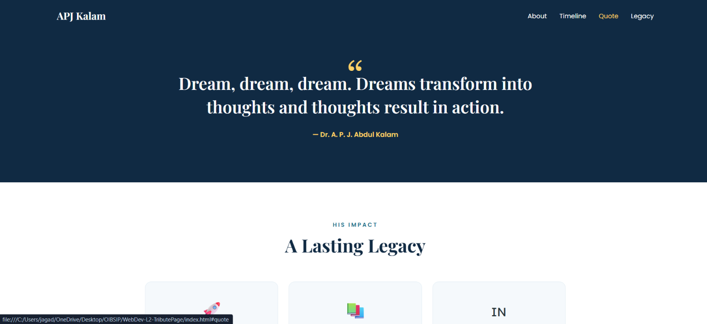
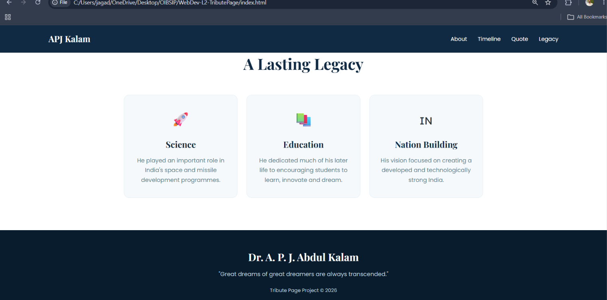
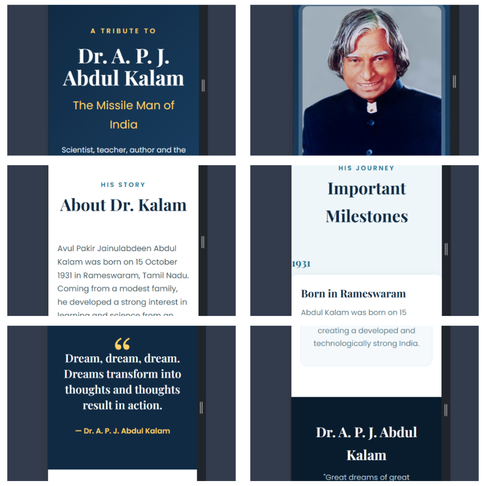

# Dr. A. P. J. Abdul Kalam - Tribute Page

A responsive tribute webpage dedicated to **Dr. A. P. J. Abdul Kalam**, one of India's most respected scientists, educators, authors, and former President.

The project is built using **HTML5, CSS3, and JavaScript** with a focus on clean design, responsive layout, and simple interactive effects.

## 📌 Project Overview

This tribute page presents important information about Dr. A. P. J. Abdul Kalam, including his biography, major achievements, important milestones, inspirational quote, and lasting legacy.

The page is designed to work across desktop, tablet, and mobile screen sizes.

## 🚀 Features

- Responsive tribute page
- Hero section with Dr. Kalam's name and tagline
- Prominent portrait image
- Biography section
- Timeline of important life events
- Key achievements and contributions
- Inspirational quote section
- Legacy section
- Smooth scrolling navigation
- Scroll reveal animations
- Responsive mobile layout
- Multiple background colors
- Serif and sans-serif typography

## 🛠️ Technologies Used

- **HTML5** - Page structure and semantic elements
- **CSS3** - Styling, layout, animations, and responsive design
- **JavaScript** - Smooth scrolling and scroll reveal effects
- **Google Fonts** - Playfair Display and Poppins
- **Wikimedia Commons** - Tribute image source

## 📂 Project Structure

```text
tribute-page/
│
├── index.html
├── style.css
├── script.js
└── README.md
```

### File Description

| File | Description |
|---|---|
| `index.html` | Contains the structure and content of the tribute page |
| `style.css` | Contains all styling, layout, animations, and responsive rules |
| `script.js` | Handles smooth scrolling and scroll reveal animations |
| `README.md` | Project documentation |

## 🎨 Page Sections

### 1. Hero Section

Introduces Dr. A. P. J. Abdul Kalam with:

- His name
- "The Missile Man of India" tagline
- Short introduction
- Portrait image
- Call-to-action button

### 2. About Dr. Kalam

Provides a brief biography covering his:

- Childhood
- Education
- Scientific career
- Contribution to India's space and defence programmes
- Presidency
- Work with students and young people

### 3. Important Milestones

The timeline highlights important events from his life, including:

- **1931** - Born in Rameswaram
- **1960** - Joined DRDO
- **1969** - Joined ISRO
- **1980** - SLV-III successfully placed the Rohini satellite into orbit
- **1997** - Received the Bharat Ratna
- **2002** - Became the 11th President of India
- **2015** - Passed away while delivering a lecture to students

### 4. Quote Section

The page includes an inspirational quote attributed to Dr. A. P. J. Abdul Kalam.

### 5. Legacy

Highlights his contributions to:

- Science and technology
- Education
- Youth inspiration
- Nation building

## 📱 Responsive Design

The website uses CSS media queries to adapt the layout for different screen sizes.

### Desktop

- Two-column hero layout
- Horizontal navigation
- Three-column legacy cards
- Full timeline layout

### Tablet

- Adjusted spacing and image sizes
- Flexible hero layout
- Responsive cards

### Mobile

- Stacked hero section
- Mobile-friendly navigation
- Single-column content
- Simplified timeline
- Smaller typography

## ⚙️ JavaScript Functionality

JavaScript is used for two main features.

### Smooth Scrolling

Navigation links smoothly scroll to the corresponding sections instead of jumping directly to them.

### Scroll Reveal Animation

Timeline items, biography paragraphs, and legacy cards appear with a subtle animation as they enter the viewport.

## ▶️ How to Run

No installation or build tools are required.

1. Download or clone the project.
2. Open the project folder.
3. Make sure these files are in the same directory:

```text
index.html
style.css
script.js
```

4. Open `index.html` in a web browser.

You can also use **VS Code with Live Server** for easier development.

## 🌐 Image Source

The portrait used in this project is sourced from **Wikimedia Commons**.

When submitting or publishing the project, verify the image's current license and attribution requirements on its Wikimedia Commons page.

## 📚 Research Sources

The biographical information was researched using reliable reference sources such as:

- Wikipedia
- Encyclopaedia Britannica
- Wikimedia Commons

The content in the webpage has been written in a summarized and paraphrased form rather than copied directly.

## 🎯 Project Objective

The objective of this project is to demonstrate the ability to:

- Build a webpage using HTML5
- Style a webpage using CSS3
- Create responsive layouts
- Use different typography styles
- Structure information using sections and timelines
- Add basic JavaScript interactions
- Use external resources responsibly
- Create an engaging tribute webpage

## 👨‍💻 Author

**Jagadeshwaran J**

Built as a frontend web development project using HTML, CSS, and JavaScript.

## 📄 License

This project is created for **educational and portfolio purposes**.

Please check the individual licenses of external resources, fonts, and images before using them in commercial projects.

## 📸 Screenshots

### Desktop - Home Page



### Biography Section



### Timeline


### Quote Section



### Legacy Section



### Mobile Responsive View


